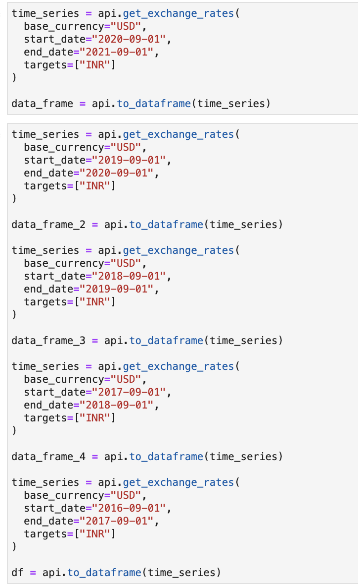
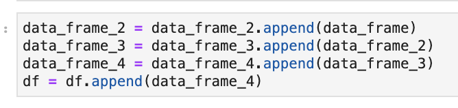
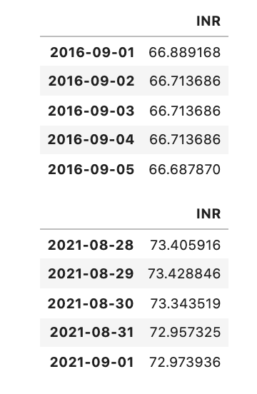
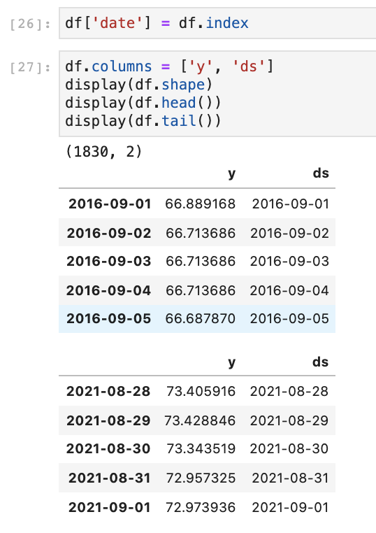
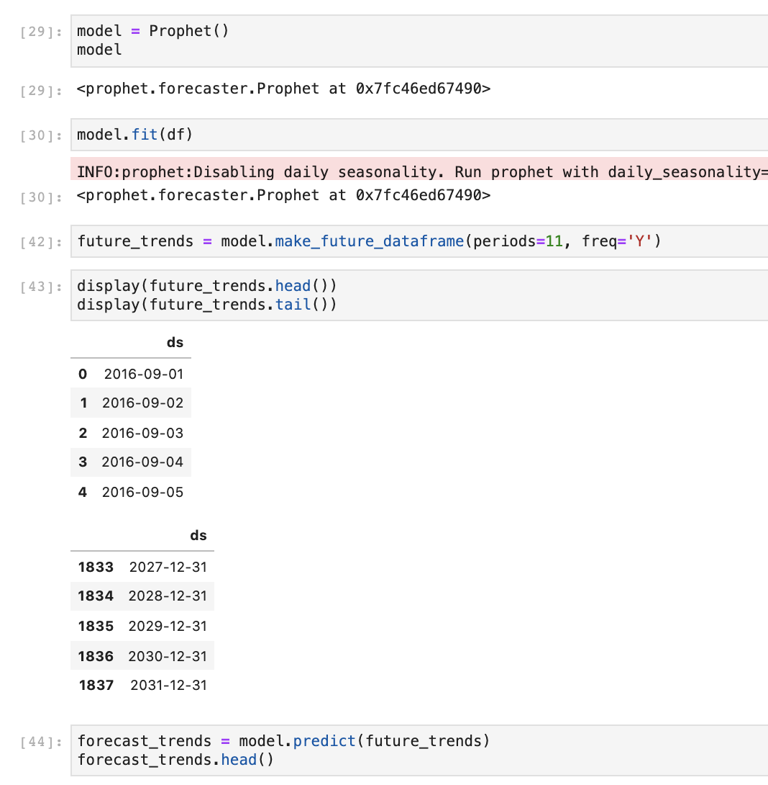

# International Fixed Rate Investment Analysis

The goal of this analysis is to evaluate the risk of investing in India, where the interest rate for a fixed rate deposit is significantly higher than the interest rate is for a similar investment in America. The problem with investing in India, is that the exchange rate is constantly increasing, and could potentially make this type of investment invaluable and negate any potential returns. This project uses machine learning to predict the future exchange rate between the Indian Rupee and US Dollar, and determine whether a long-term, fixed rate investment, would be successful.

## Project Steps

1. Simulate a 10 year 100,000 dollar investment in both the United States given the current average Certificate Of Deposit (CD) rates.
2. Convert 100,000 dollars to rupees based off of the current exchange rate and simulate a 10 year investment given the average Fixed Deposit (FD) rates in India.
3. Access the previous 10 years of exchange rate datas and use it to fit a Facebook Prophet Model.
4. Use this Prophet Model to predict the most probable exchange rate after 10 years.
5. Convert the Indian investment back in to US Dollars given the predicted future exchange rate and compare the returns of both investments.

## Data Preparation

To collect the data I used forex-python, which is a python library that gets foreign exchange data via ratesapi.io, a free API for current and historical foreign exchange rates published by European Central Bank. I collected the data by gathering historical data for ten individual years, since the library only allowed me to access one year at a time, and merged them into one dataframe. I also re-formatted the data by making another column for the date, as the index would be unable to be input into the model. To fit the model, I set the date and exchange rates as ‘ds’ and ‘y’ respectively in order for Prophet to recognize the values, and fit the model accordingly.

## Fitting the Model 

## Summary

After ten years, the investment in India is likely to end up returning 144,579.63 dollars and the investment in the United States is likely to end up returning 105,114.01 dollars, giving the investment in India about a 37.5% greater return.

